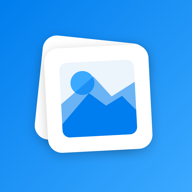

<p align="center">
  
</p>

<h1 align="center">Printly (Android)</h1>

<p align="center">
  A fully offline photo &amp; document print-layout app, built with Kotlin and Jetpack Compose.<br/>
  Android port of the <a href="https://github.com/Abhishek-Patoliya/Printly">iOS Printly app</a> — same data model, same layout math, same feature set.
</p>

---

## Screenshots

*Coming soon — this build hasn't been run on a device/emulator yet. See [Build &amp; run](#build--run) below to try it yourself, or drop screenshots into `screenshots/` and reference them here.*

<!--
| Home | Templates | Editor | Crop |
|---|---|---|---|
|  |  |  |  |
-->

## What it does

Printly lays out photos and documents on a page at exact physical dimensions and exports a print-ready file — no cropping surprises, no "fit to page" guessing. Everything runs on-device; no account, no network calls, no analytics.

- **Photo prints** — standard sizes (4×6, 5×7, wallet, full-page, …) or an exact custom size in mm/cm/in
- **Passport / ID photos** — built-in sizes for 40+ countries' documents, on-device face detection to auto-center the crop, on-device background replacement (white/gray/blue/custom)
- **Collages** — 2 to 16 photos tiled edge-to-edge on one page
- **Labels & stickers** — blank text labels, common Avery sheet layouts, QR code / Code 128 barcode insert
- **Poster Print** — blow up one photo across a grid of pages with overlap, to trim and tape into a full-size poster
- **Full page editor** — drag, resize (8-handle), and rotate every placement; snap-to-guide alignment; undo/redo; multi-select batch actions; cut guides; contact-sheet numbering
- **Photo editing** — crop/pan/zoom/rotate, flip, brightness/contrast, fit vs. fill, text overlay/watermark, border
- **Export** — print-ready PDF (exact physical page size) or JPG/PNG at 150/300/600 DPI; print via the system print dialog, share, or save to a folder
- **Templates** — built-in library plus your own saved templates
- **Export history**, **recent sizes**, **per-project settings that survive relaunch**
- **App Shortcuts** — long-press the launcher icon to jump straight into a passport photo, photo print, collage, or label

## Build & run

Requires Android Studio (or the command line with a JDK 17+ and the Android SDK) and a device/emulator running **API 26+**.

```bash
git clone https://github.com/Abhishek-Patoliya/PrintlyAndroid.git
cd PrintlyAndroid
./gradlew assembleDebug        # build only
./gradlew installDebug         # build + install on a connected device/emulator
```

Or open the folder directly in Android Studio and hit Run.

## Tech stack

- **Kotlin** + **Jetpack Compose** (Material 3), MVVM
- **kotlinx.serialization** for JSON project/template persistence (app-internal storage, no cloud)
- **ML Kit** (bundled, on-device, no network) for face detection and selfie segmentation — the Android equivalent of iOS's Vision framework
- **`android.graphics.pdf.PdfDocument`** for vector PDF export, **`PdfRenderer`** for PDF import
- **ZXing** for QR/barcode generation
- Android **Photo Picker**, **CameraX-free `TakePicture` contract**, **Storage Access Framework** for save-to-files, **PrintManager** for native printing

No third-party backend, no ads, no in-app purchases.

## Project structure

```
app/src/main/kotlin/com/a8000053398/printly/
├── model/            data classes (mirrors the iOS models 1:1)
├── service/           pure layout/geometry math, PDF/image export, persistence, photo processing
│   ├── layout/         grid packing, resize geometry, rotation math, cut guides, collage tiling
│   ├── pdf/             PDF + image renderers
│   ├── photo/            crop/transform, face detection, background removal, photo import
│   └── persistence/    project/template/export-history/settings stores
├── viewmodel/         HomeViewModel, ProjectEditorViewModel
└── ui/
    ├── home/ templates/ settings/ export/ poster/   top-level screens
    ├── editor/            the page editor, canvas, sheets, and full-screen crop editor
    ├── components/       shared design-system pieces (buttons, cards, mini layout preview, brand mark)
    └── theme/              Material 3 theme + SF Symbol → Material icon mapping
```

The `service/layout` package is a direct, line-for-line port of the iOS app's layout engine — same algorithms, so a given page size / photo size / margin / spacing combination produces an identical grid on both platforms.

## Relationship to the iOS app

This is a from-scratch Android implementation, not a wrapper or cross-platform port. Same package identity, same data model, same on-disk project/JSON format shape, same physical-measurement math (1pt = 1/72in throughout, exactly like the iOS app's PDF pipeline) — but the UI is built natively in Compose/Material 3, and a handful of iOS-specific mechanisms have platform-appropriate equivalents instead of a 1:1 copy:

| iOS | Android |
|---|---|
| SF Symbols | Material Icons |
| Vision (face detection / person segmentation) | ML Kit (bundled, on-device) |
| Siri Shortcuts / App Intents | Android App Shortcuts |
| AirPrint | Android `PrintManager` |
| `UIDocumentPickerViewController` | Storage Access Framework (`CreateDocument` / `OpenDocumentTree`) |

## License

No license file yet — all rights reserved by default. Add one if you want this reused.
